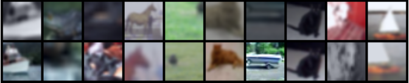

# SimCLR in Pytorch (wip)

An unofficial (and simplified) implementation of [SimCLR](https://arxiv.org/abs/2002.05709). 

## Data 
The [CIFAR-10](https://www.cs.toronto.edu/~kriz/cifar.html) dataset is used to build a prototype. 

Below is a sample of augmented CIFAR-10 data:

 
## Cite 
```@article{chen2020simple,
  title={A Simple Framework for Contrastive Learning of Visual Representations},
  author={Chen, Ting and Kornblith, Simon and Norouzi, Mohammad and Hinton, Geoffrey},
  journal={arXiv preprint arXiv:2002.05709},
  year={2020}
}